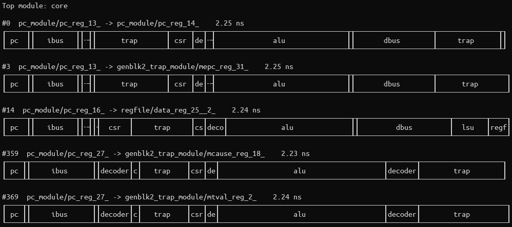

# GPro 1 (Lexington) RISC-V CPU

The GPro 1 (Lexington) is the first generation of RISC-V processors designed by
[Gerber Prototyping](https://g-proto.com).
Intended for educational use for simulation, FPGA implementation, and physical design.
The current toolchain uses AMD Xilinx Vivado:registered: and the
[RISC-V GNU Compiler toolchain](https://github.com/riscv-collab/riscv-gnu-toolchain).
Supported target hardware is the [Digilent:registered: Basys 3 Artix-7 FPGA](https://digilent.com/shop/basys-3-artix-7-fpga-trainer-board-recommended-for-introductory-users/).
The project is made to be easily adaptable to any Xilinx product.

The GPro 2 (Saratoga) is currently in early development. The current status can be found at
[https://github.com/GProCPU/Saratoga](https://github.com/GProCPU/Saratoga),

## Features

- RV32I instruction set
- CSR extension
- Machine-mode and User-mode privilege levels
- Modified-Harvard architecture
- Single cycle execution
- Machine timer with interrupt support
- 2 General purpose timer with interrupt support
- 48 GPIO (3 banks of 16 pins)
- 6 external interrupt pins (2 per GPIO bank)
- UART interface with interrupt support

## Project Status

| Component | Docs | Sim | FPGA |
| --- | --- | --- | --- |
| Core  |       |        | 
| AXI   |       |        | 
| GPIO  |       |        | 
| Timers|   |  | 
| UART  |     |     | 

## Design and Microarchitecture

Complete design documentation can be found in [docs/Lexington.md](./docs/Lexington.md)

## Getting Started

The toolchain can be set up using either a Linux environment or a hybrid Windows/WSL environment.
Some Linux is required as the RISC-V GNU toolchain does not support Windows.

### Vivado

Install Vivado on either Linux or Windows.
If using Windows, you must also install git for Windows using the default install directory.

### GCC

To install the RISC-V GNU toolchain by following [these instruction](./docs/Toolchain.md).
If using Windows, this must installed in WSL.

## Timing Analysis

Static timing analysis was performed on the core using Synopsys Design Compile and
PrimeTime. The intent was to observe dataflow through the processor and the various
modules. This information helped make informed designs about pipeline design
for future generations of GPro processors.

A custom script was developed to parse, filter, and visualize the path report
generated by Synopsys PrimeTime. Major features are the visualize of the delay
path through each module as well as the filtering of unique results. In this
context, paths are not *unique* if they have the same start point and end point.
Different bits in the same register are not considered unique.

Filtering the 1,000 worst delay paths for uniqueness results in only 5 unique
paths. This demonstrates orders-of-magnitude of simplification and allows RTL
designers to quickly locate problematic logic. In Figure 1, paths #359 and #369
are the detection of a misaligned branch address.

 \
**Figure 1.** Timing analysis of Lexington core
