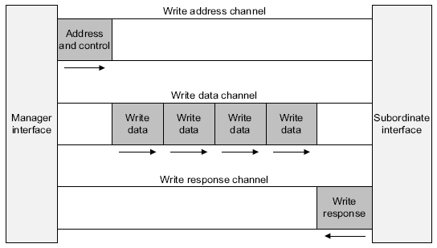
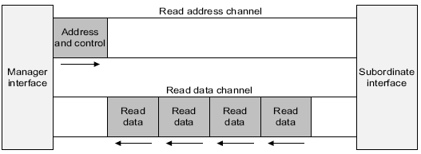
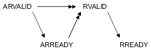
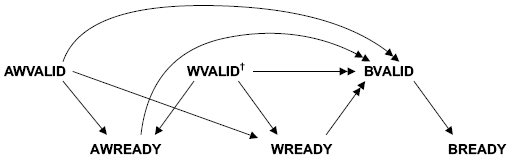

# AXI4-Lite

This documents is a brief overview of AXI4-Lite interface and protocol.
It is a summary of information found in the *AMBA AXI and ACE Protocol Specification*.

## Ports

The AXI protocol defines five independent transaction channels:
- Read address (prefix AR)
- Read data (prefix R)
- Write address (prefix AW)
- write data (prefix W)
- Write response (prefix B)

 \
**Figure 1.** Write channels

 \
**Figure 2.** Read channels

### Parameters

- **`WIDTH = 32`** bus width
- **`ADDR_WIDTH`** address width

### Global Signals

- **`ACLK`** global clock signal
- **`ARESETn`** global reset signal (active-LOW)

### Write Address Channel (AW)

- **`AWVALID`** write address channel is valid (Manager)
- **`AWREADY`** write address channel is ready (Subordinate)
- **`AWADDR`** address of the write transaction (Manager)
- **`AWPROT`** protection attributes of the write transaction (Manager)

### Write Data Channel (W)

- **`WVALID`** write data channel is valid (Manager)
- **`WREADY`** write data channel is ready (Subordinate)
- **`WDATA`** write data (Manager)
- **`WSTRB`** write strobe, indicates which byte lanes hold valid data (Manager)

### Write Response Channel (B)

- **`BVALID`** write response channel valid (Subordinate)
- **`BREADY`** write response channel ready (Manager)
- **`BRESP`** write response, indicates status of write transaction (Subordinate)

### Read Address Channel (AR)

- **`ARVALID`** read address channel valid (Manager)
- **`ARREADY`** read address channel ready (Subordinate)
- **`ARADDR`** address of the read transaction (Manager)
- **`ARPROT`** protection attributes of the read transaction (Manager)

### Read Data Channel (R)

- **`RVALID`** read data channel valid (Subordinate)
- **`RREADY`** read data channel ready (Manager)
- **`RDATA`** read data (Subordinate)
- **`RRESP`** read response, indicates status of read transaction (Subordinate)

## Behavior

### Clock and Reset

All synchronous signals are sampled on the rising-edge of `ACLK`.

The `ARESETn` is an active-LOW reset signal.
It can be asserted asynchronously, but must be de-asserted synchronous to a rising-edge of `ACLK`.
During reset, all `VALID` signals must be driven LOW.
The `VALID` signals must wait a minimum of one clock cycle before being asserted (i.e. must reset to LOW).

### Handshake

Each channel includes a pair of `VALID` and `READY` signals.
The channels *source* controls controls `VALID` while `READY` is controlled by the *destination*.
A transfer occurs on the rising-edge of the clock when both `VALID` and `READY` signals are HIGH.

***Important:** a source is not permitted to wait until `READY` is asserted before asserting `VALID`.*

***Important:** when `VALID` is asserted, it must remain asserted until the transaction occurs.*

***Important:** there must be no combinatorial paths between input and output signals*

***Note:** a destination is permitted to wait for `VALID` to be asserted before asserting `READY`.*

***Note:** if `READY` is asserted, it may be de-asserted before a transaction occurs.*

### Relationships between the channels

The AXI protocol requires the following relationships to be maintained:
- A write response must always follow a write data transfer.
- Read data must always follow a read address transfer.
- Channel handshakes must conform to the dependencies defined in [Dependencies between channel handshake signals](#dependencies-between-channel-handshake-signals).

#### Dependencies between channel handshake signals

To prevent a deadlock situation, the handshake dependency rules must be observed.

The following read transaction dependencies must be observed:
- The Subordinate must wait for both `ARVALID` and `ARREADY` before asserting `RVALID`.

The following read transaction dependencies must be observed:
- The Subordinate must wait for  `AWVALID`, `AWREADY`, `WVALID`, and `WREADY` before asserting `BVALID`.

Figures 3 and 4 depict detailed the handshake signal dependencies of read and write transactions respectively.
In the dependency diagrams of Figure 3 and 4:
- Single-headed arrows represents an *optional* dependency, meaning the signal at the end of the arrow *may* wait for the signal at the start of the arrow.
- Double-headed arrows represent a *hard* dependency, meaning the signal at the end of the arrow *must* wait for the signal at the start of the arrow.
- A signal may only be directly dependent on another signal if there is an arrow pointing from the dependency signal to the dependent signal.

 \
**Figure 3.** Read transaction handshake dependencies

 \
**Figure 4.** Write transaction handshake dependencies
