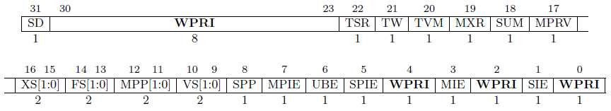
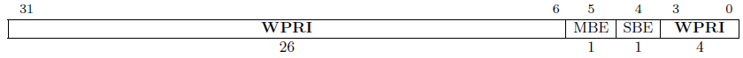

# CSR

## Machine Level

#### Machine ISA Register `misa`

The `misa` reports the ISA supported by the hart.
The register is W/R, but this implementation ignores all write values.
Figure 1 shows the field encoding

 \
**Figure 1.** Field encoding for `miso`

The two-bit `MXL` field encodes the native base integer ISA width.
The value of `MXL` is 1 for the 32-bit GPro Lexington core.

The Extensions field encodes the presence of standard ISA extensions.
Each bit encodes one letter of the alphabet with bit 0 encoding the "A" extension and bit 25 encoding the "Z" extensions.
The only extension bit asserted in this implementation is bit eight, the "I" bit.

This implementation ignores writes the `misa` register

#### Machine Vendor ID Register `mvendorid`

A read-only register encoding the JEDEC manufacturer ID.
This implementation returns 0x0, indicating a non-comercial implementation.

#### Machine Architecture ID Register `marchid`

A read-only register encodes the base microarchitecture of this hart.
This implementation returns 0x0, indicating no allocated architecture ID.

#### Machine Implementation ID Register `mimpid`

This read-only register encodes the version of the processor implementation as a subset of the architecture ID.
This implementation returns 0x1, indicating the first iteration of the GPro CPU.

#### Hart ID Register `mhartid`

This read-only register encodes the execution environment unique, integer ID of the hardware thread.
This implementation returns 0x0 as there is only one hardware thread in the GPro Lexington core.

#### Machine Status Register `mstatus` and `mstatush`

The read/write registers tracks and controls the hart's current operating state.
Figures 2 and 3 show the encoding of `mstatus` and `mstatush` respectively.
This implementation only supports machine mode and thus register returns 0x0 and ignores write values.

 \
**Figure 2.** Encoding of `mstatus` register

 \
**Figure 3.** Encoding of `mstatush` register

#### Machine Trap-Vector Base-Address Register `mtvec`

This read/write register contains the address of the trap handler function.
All addresses are forced to be 4-byte aligned by setting the lowest two bits to zero.
The default value on reset is 0x0.

#### Machine Interrupt Register `mip` and `mie`

These read/write registers are the Machine Interrupt Pending (`mip`) and Machine Interrupt Enable (`mie`) registers.
This implementation only supports non-maskable interrupts, thus this register is read-only zero.

#### Machine Cycle Counter `mcycle` and `mcycleh`

Counts the number of clock cycles executed by this hart.
A 64-bit read-write register with value zero at reset.

#### Machine Instructions Retired Counter `minstret` and `minstreth`

Counts the number of instructions retired by this hart.
A 64-bit read-write register with value zero at reset.

#### Machine Performance Counters `mhpmevent3[h]`-`mhpmevent31[h]`

These 64-bit registers are read-only zero.

#### Machine Scratch Register `mscratch`

A general-purpose read/write register for use by machine mode.

#### Machine Exception Program Count `mepc`

This read/write register holds the address of instruction that was interrupted or caused an exception when a trap is encountered in machine mode.
This implementation uses `IALIGN`=32 and thus the least significant two bits are always zero and write values to these bits are ignored.

#### Machine Cause Register `mcause`

This read/write register encodes the event type that caused a trap.
Only legal values are allowed to be written.
The MSB is asserted if this trap was caused by an interrupt.
All other bits encode the trap type.
Tables 1 and 2 contain the trap codes for interrupts and exceptions respectively.
Trap code priorities are in Table 3.

**Table 1.** Interrupt trap codes
| Trap Code | Description |
| --- | --- |
| 1 | Supervisor software interrupt |
| 3 | Machine software interrupt |
| 5 | Supervisor timer interrupt |
| 7 | Machine timer interrupt |
| 9 | Supervisor external interrupt |
| 11 | Machine external interrupt |

**Table 2.** Exception trap codes
| Trap Code | Description |
| --- | --- |
| 0 | Instruction address misaligned |
| 1 | Instruction access fault |
| 2 | Illegal instruction |
| 3 | Breakpoint |
| 4 | Load address misaligned |
| 5 | Load access fault |
| 6 | Store/AMO address misaligned |
| 7 | Store/AMO access fault |
| 8 | Environment call from U-mode |
| 9 | Environment call from S-mode |
| 11 | Environment call from M-mode |
| 12 | Instruction page fault |
| 13 | Load page fault |
| 15 | Store/AMO page fault |

**Table 3.** Trap code priority
| Priority | Trap Code | Description |
| --- | --- | --- |
| *Highest* | 3 | Instruction address breakpoint |
| | 1 | Instruction access fault |
| | 2 0 8, 9, 11 3 3 | Illegal instruction Instruction address misaligned Environment call Environment break Load/store/AMO address breakpoint |
| | 4, 6 | Load/store/AMO address misaligned |
| *Lowest* | 5, 7 | Load/store/AMO access fault |

*Instruction address misaligned exceptions are raised by control-flow instructions with misaligned targets, rather than by the act of fetching an instruction*

#### Machine Trap Value Register `mtval`

This read/write register contains exception-specific information.

On an illegal instruction exception, the `mtval` register is set to the faulting instruction bits.

All other traps write a value of zero to `mtval`.

#### Machine Configuration Pointer Register `mconfigptr`

This is a read-only zero register indicating that a configuration data structure does not exist.

