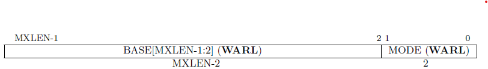
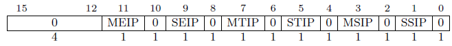
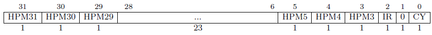

# Control and Status Registers (CSR)

The CSR module is responsible for CSR reads and writes as well as CSR specific behaviors.
It raises an illegal instruction exception is raised in the following cases:
- Read or write to an invalid CSR address or unprivileged access to a privileged CSR
- Write to a read-only CSR

The [`mip`](#machine-interrupt-pending-mip),
[`mepc`](#machine-exception-program-count-mepc),
[`mcause`](#machine-cause-register-mcause),
and [`mtval`](#machine-trap-value-register-mtval)
CSRs are contained in the [Trap Unit](./Trap.md)

For CSR related instructions see the
[CSR Instruction](./CSR.md#control-and-status-registers-csr) section of the
Decode Unit.

The CSR unit uses synchronous/clocked logic.
However, trap CSR operations are delegated to the trap unit using combinatorial logic.

This document uses the RISC-V Specification definitions of *trap*, *exception*,
and *interrupt*.
- *trap*: the synchronous transfer of control to a trap handler caused by an
  *exception* or *interrupt*
- *exception*: an unusual condition occurring at run time associated with an
  instruction in the current hart.
- *interrupt*: an external event that occurs asynchronously to the current hart.

## Ports

### Parameters

- **`XLEN=32`** data width (from rv32)
- **`CSR_ADDR_WIDTH=12`** CSR address width (from rv32)
- **`HART_ID=0`** hardware thread id (see [`mhartid`](#hart-id-register-mhartid))

### Inputs

- **`clk`** processor clock
- **`rst_n`** active-low synchronous reset
- **`rd_en`** read enable
- **`explicit_rd`** flag indicating explicit CSR read (ignored in this implementation)
- **`wr_en`** write enable
- **`addr[CSR_ADDR_WIDTH-1:0]`** read address
- **`wr_data[XLEN-1:0]`** write data
- **`trap_rd_data[XLEN-1:0]`** read data for trap CSRs
- **`time_rd_data[63:0]`** read-only unprivileged time and timeh CSRs
- **`trap`** signals trap taken

### Outputs

- **`priv[1:0]`** current privilege mode (M-Mode=3,U-Mode=0)
- **`rd_data[XLEN-1:0]`** read data
- **`global_mie`** global machine-mode interrupt enable
- **`trap_rd_en`** trap CSR read enable
- **`trap_wr_en`** trap CSR write enable
- **`endianness`** data memory endianness (0=little,1=big)
- **`illegal_csr`** indicates illegal CSR address or access permission


## Read and Write Behavior Specifications

The following bit field read/write names are taken from the RISC-V ISA Volume II: Privileged Architecture

### Write Preserve, Read Ignore (WPRI)

Some whole read/write fields are reserved for future use.
Software should preserve these values when writing.
Hardware must make them read-only zero.

### Write Legal, Read Legal (WLRL)

Software should only write legal values.
This implementation allows writing and reading illegal values and does not raise an exception.

### Write Any, Read Legal (WARL)

Software may write any value, but will read only legal values.
This implementation ignores illegal write values


## Machine-Mode CSRs

### Machine ISA Register `misa`

*0x301*
$~~~~$ **Read-Only**

The `misa` reports the ISA supported by the hart.
This implementation makes this register read-only
Figure 1 shows the field encoding

 \
**Figure 1.** Field encoding for `misa`

The two-bit `MXL` field encodes the native base integer ISA width as shown in Table 1.
The value of `MXL` is 1 for the 32-bit GPro 1 (Lexington).

**Table 1.** MXL bit field encoding

| XLEN | 32 | 64 | 128 |
| --- | --- | --- | --- |
| MXL | 1 | 2 | 3 |

The Extensions field encodes the presence of standard ISA extensions. Each bit
encodes one letter of the alphabet with bit 0 encoding the "A" extension and
bit 25 encoding the "Z" extensions. The letter "X" denotes any non-standard
extensions The only extension bit asserted in this implementation is bit eight,
the "I" bit.


### Machine Vendor ID Register `mvendorid`

*0xF11*
$~~~~$ **Read-Only**

A read-only register encoding the JEDEC manufacturer ID. This implementation
returns 0x0, indicating a non-comercial implementation.


### Machine Architecture ID Register `marchid`

*0xF12*
$~~~~$ **Read-Only**

A read-only register encodes the base microarchitecture of this hart. This
implementation returns 0x0, indicating no allocated architecture ID.


### Machine Implementation ID Register `mimpid`

*0xF13*
$~~~~$ **Read-Only**

This read-only register encodes the version of the processor implementation as a
subset of the architecture ID. This implementation returns 0x1, indicating the
first iteration of the GPro CPU.


### Hart ID Register `mhartid`

*0xF14*
$~~~~$ **Read-Only**

This read-only register encodes the execution environment unique, integer ID of
the hardware thread. This implementation returns 0x0 as Lexington only supports a
single hardware thread.


### Machine Status Register `mstatus` and `mstatush`

*0x300* and *0x310*
$~~~~$ **Atomic**

The read/write registers tracks and controls the hart's current operating state.
Figures 2 and 3 show the encoding of `mstatus` and `mstatush` respectively.


 \
**Figure 2.** Encoding of `mstatus` register

 \
**Figure 3.** Encoding of `mstatush` register

**Table 2.** Fields of `mstatus` register

| Bit(s) | Name| R/W | Default Value | Description |
| --- | --- | --- | --- | --- |
| 1     | SIE   | r/- | 1 | ~~Supervisor-mode interrupt enable~~ |
| 3     | MIE   | r/w | 1 | Manager-mode interrupt enable |
| 5     | SPIE  | r/- | 1 | ~~Supervisor-mode previous interrupt enable~~ |
| 6     | UBE   | r/w | 0 | User-mode data memory endianness (0=little,1=big)
| 7     | MPIE  | r/w | 1 | Manager-mode previous interrupt enable |
| 8     | SPP   | r/- | 0 | ~~Supervisor-mode previous privilege mode~~ |
| 10:9  | VS    | r/- | 0 | ~~Vector extension state~~ |
| 12:11 | MPP   | r/w | 3 | Manager-mode previous privilege mode |
| 14:13 | FS    | r/- | 0 | ~~Floating-point unit state~~ |
| 16:15 | XS    | r/- | 0 | ~~Additional user-mode extensions state~~ |
| 17    | MPRV  | r/w | 0 | Modify effective privilege |
| 18    | SUM   | r/- | 0 | ~~Permit supervisor user memory access~~ |
| 19    | MXR   | r/- | 0 | ~~Make executable readable~~ |
| 20    | TVM   | r/- | 0 | ~~Trap virtual memory~~ |
| 21    | TW    | r/- | 0 | ~~Timeout wait~~ |
| 22    | TSR   | r/- | 0 | ~~Trap SRET~~ |
| 31    | SD    | r/- | 0 | ~~Extensions state summary~~ |
| 36 (4)| SBE   | r/- | 0 | ~~Supervisor-mode data memory endianness~~ |
| 37 (5)| MBE   | r/w | 0 | Manager-mode data memory endianness (0=little,1=big) |

When a trap is taken:
- `MPIE` is set to `MIE`
- `MIE` is set to 0
- `MPP` is set to current privilege mode

When an `xRET` instruction is executed:
- privilege mode is set to `MPP`
- `MIE` is set to `MPIE`
- `MPIE` is set to 1
- `MPP` is set to 0 (i.e. user-mode, lowest privilege)
- If `MPP` is not M-Mode, then `MPRV` is set to 0


### Machine Trap-Vector Base-Address Register `mtvec`

*0x305*
$~~~~$ ***Delegated to Trap Unit***

This read/write register contains the address of the trap handler function. All
addresses are forced to be 4-byte aligned and the address's 2 LSBs are ignored.
The 2 LSBs of the `mtvec` register contain the addressing mode of the trap-vector
table. The default value on reset is 0x0000_0000.

 \
**Figure 4.** Encoding of `mtvec`

**Table 3.** Trap-Vector Addressing modes

| Value | Name | Description |
| --- | --- | --- |
| 0 | Direct | All traps set PC to BASE |
| 1 | Vectored | Asynchronous interrupts set PC to BASE+(4*cause) |
| $\ge$ 2 | - | *Reserved* |

If using direct mode, all exceptions and interrupts trap to PC = BASE.

If using vectored mode, the 5 LSBs of BASE are zeroed, thus forcing 128-byte
alignment of the trap-vector table. This allows interrupt causes 0-31 to use the
vectored addressing mode. Interrupts causes $\ge$ 32 always use direct addressing.
Exceptions always trap to PC = BASE. See the
[`mcause` CSR](#machine-cause-register-mcause) for interrupt cause IDs.

Resets and NMIs always reset to the hardware defined RESET_ADDR (typically 0x0000_0000).

### Machine Interrupt Pending `mip`

*0x344*
$~~~~$ ***Delegated to Trap Unit***

This read/write register encodes pending interrupts. Bit *i* corresponds to
interrupt cause number *i* as reported in CSR [`mcause`](#machine-cause-register-mcause).
Pending interrupts are not cleared by hardware but must be cleared by software
by clearing the corresponding bit. The exception are the standard interrupt bits.

Bits 15:0 encode the standard interrupt causes as shown in Table 4. These bits
have unique behaviors such as being read-only. They must be cleared by resolving
the interrupt source (ex. write
[`mtimecmp[h]`](#machine-timer-registers-mtime-and-mtimecmp) $\lt$ [`mtime[h]`](#machine-timer-registers-mtime-and-mtimecmp)).

Additional interrupt sources are listed in the [`mcause`](#machine-cause-register-mcause)
section. These bits are read/write and the bit must be cleared by software in the
trap handler. Some interrupt sources may also require that the source of the
interrupt is resolved.

See the [Trap Unit](./Trap.md) for detailed trap behavior.



**Table 4.** Standard Interrupt Bits (read-only bits)

| Bit | Name | Description |
| --- | --- | --- |
| 1  | SSIP | ~~Supervisor-level software interrupt pending~~
| 3  | MSIP | ~~Machine-level software interrupt pending~~
| 5  | STIP | ~~Supervisor-level timer interrupt pending~~
| 7  | MTIP | Machine-level timer interrupt pending
| 9  | SEIP | ~~Supervisor-level external interrupt pending~~
| 11 | MEIP | ~~Machine-level external interrupt pending~~

**Table 5.** Interrupt Priority

| Priority | Interrupt Type |
| --- | --- |
| *Highest* | ~~MEIP~~
|           | ~~MSIP~~
| *Lowest*  | MTIP


### Machine Interrupt Enable `mie`

*0x304*
$~~~~$ ***Delegated to Trap Unit***

This read/write register encodes the enable for interrupts. Bit *i* corresponds
to interrupt cause number *i* as reported in the [`mcause` CSR](#machine-cause-register-mcause).
All bits are writable, even if the corresponding interrupt is not supported. The
register is set to 0 at reset. See ['mip'](#machine-interrupt-pending-mip) for
related information.


### Machine Cycle Counter `mcycle` and `mcycleh`

*0xB00* and *0xB80*

unprivileged: *0xC00* and *0xC80*
$~~~~$ **Read-Only**

Counts the number of clock cycles executed by this hart.
A 64-bit, read/write register with value zero at reset.
The `cycle` CSR is a read-only shadow of the unprivileged `mcycle`.

The following code is an example of reading 64-bit performance counters:

```asm
again:
    rdcycleh    x3
    rdcycle     x2
    rdcycleh    x4
    bne         x3, x4, again
```


### Machine Instructions Retired Counter `minstret` and `minstreth`

*0xB02* and *0xB82*

unprivileged: *0xC02* and *0xC82*
$~~~~$ **Read-Only**

Counts the number of instructions retired by this hart.
A 64-bit read-write register with value zero at reset.
The value is not incremented on cycles where a CSR write occurs.
The `instret` CSR is a read-only shadow of the unprivileged  `minstret`


### Machine Counter-Inhibit CSR `mcountinhibit`

*0x320*

This register can be used to disable individual performance counters.
This implementation only supports the `mcycle` (`CY` bit) and `minstret` (`IR` bit) counters.
All other bits are writable but ignored.
Reset value is 0x0.

 \
**Figure 5.** Encoding for `mcountinhibit`


### Machine Scratch Register `mscratch`

*0x340*

A general-purpose read/write register for use by machine mode.


### Machine Exception Program Count `mepc`

*0x341*
$~~~~$ ***Delegated to Trap Unit***

This read/write register holds the address of instruction that was interrupted
or caused an exception when a trap is encountered in machine mode. This
implementation uses `IALIGN`=32 and thus the least significant two bits are
always zero and write values to these bits are ignored.

See the [Trap Unit](./Trap.md) for detailed trap behavior.


### Machine Cause Register `mcause`

*0x342*
$~~~~$ ***Delegated to Trap Unit***

This read/write register encodes the event type that caused a trap. Any XLEN
value is allowed to be written to this register. The MSB is asserted if this
trap was caused by an interrupt. All other bits encode the trap type.

See the [Trap Unit](./Trap.md) for detailed trap behavior.

**Table 6.** Interrupt trap codes

| Trap Code | Description |
| --- | --- |
| 0  | Non-Maskable Interrupt (NMI) |
| 1  | ~~Supervisor software interrupt~~ |
| 3  | ~~Machine software interrupt~~ |
| 5  | ~~Supervisor timer interrupt~~ |
| 7  | Machine timer interrupt |
| 9  | ~~Supervisor external interrupt~~ |
| 11 | ~~Machine external interrupt~~ |
| 16 | UART0 RX interrupt |
| 17 | UART0 TX interrupt |
| 18 | timer0 interrupt |
| 19 | timer1 interrupt |
| 20 | GPIOA interrupt 0 |
| 21 | GPIOA interrupt 1 |
| 22 | GPIOB interrupt 0 |
| 23 | GPIOB interrupt 1 |
| 24 | GPIOC interrupt 0 |
| 25 | GPIOC interrupt 1 |

**Table 7.** Exception trap codes

| Trap Code | Description |
| --- | --- |
| 0 | Instruction address misaligned |
| 1 | Instruction access fault |
| 2 | Illegal instruction |
| 3 | Breakpoint |
| 4 | Load address misaligned |
| 5 | Load access fault |
| 6 | Store/AMO address misaligned |
| 7 | Store/AMO access fault |
| 8 | Environment call from U-mode |
| 9 | Environment call from S-mode |
| 11 | Environment call from M-mode |
| 12 | ~~Instruction page fault~~ |
| 13 | ~~Load page fault~~ |
| 15 | ~~Store/AMO page fault~~ |


### Machine Trap Value Register `mtval`

*0x343*
$~~~~$ ***Delegated to Trap Unit***

This read/write register contains exception-specific information.
See the [Trap Unit](./Trap.md) for details.


### Machine Configuration Pointer Register `mconfigptr`

*0xF15*
$~~~~$ **Read-Only**

This is a read-only zero register indicating that a configuration data structure
does not exist.

### Machine Timer Registers `mtime` and `mtimecmp`

These are 64-bit, memory-mapped registers. `mtime` and `mtimeh` are also available
as read-only, unprivileged CSRs `time` and `timeh` respectively.

**Table 8.** Machine Timer Register Addresses

| Address | Name |
| --- | --- |
| 0xC000_0000 | `mtime` |
| 0xC000_0004 | `mtimeh` |
| 0xC000_0008 | `mtimecmp` |
| 0xC000_000C | `mtimecmph` |
| CSR 0xC01   | `time` |
| CSR 0xC81   | `timeh` |


The `mtime` register is incremented every microsecond.
At reset, `mtime` is reset to 0, thus it counts microseconds since reset.
Writing to `mtime` allows for synchronization with wall-clock time.

The `mtimecmp` register is used to control the machine timer interrupt.
If `mtime` is unsigned greater than or equal to `mtimecmp` an the machine timer interrupt pending bit in [`mip`](#machine-interrupt-pending-mip) is set.
The interrupt can be cleared by writing `mtimecmp` to a value greater than `mtime`, or writing `mtime` to a value less than `mtimecmp`.

The following code sequence should be used for writes to `mtimecmp` to avoid spurious timer interrupts

```asm
# New comparand is in a1:a0.
li t0, -1
la t1, mtimecmp
sw t0, 0(t1) # No smaller than old value.
sw a1, 4(t1) # No smaller than new value.
sw a0, 0(t1) # New value.
```
