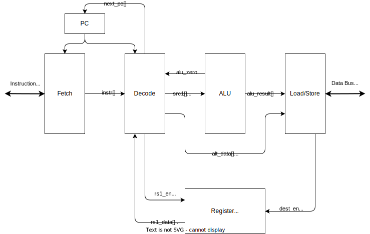

# CPU Core

This is an RV32 core.
It contains instantiations of all the necessary core submodules.
It has the following external interfaces:

- ROM: dual asynchronous read ports
- RAM: single synchronous write port and asynchronous read port
- MTIME: machine timer read/write interface
- AXI: read/write interface to AXI manager

The following are optional features of the core that can be disabled via parameters:

- CSR: control and status register instruction support can be omitted
- TRAP: exceptions and interrupts can be omitted (requires CSR to be enabled)
- MTIME: machine timer address space can be omitted
- AXI: AXI bus address space can be omitted

 \
**Figure 1.** GPro Lexington minimal core implementation

## Ports

### Parameters

- **`XLEN = 32`** data width (from rv32)
- **`ROM_ADDR_WIDTH = 10`** ROM address width (word-addressable, default 4kB)
- **`RAM_ADDR_WIDTH = 10`** RAM address width (word-addressable, default 4kB)
- **`AXI_ADDR_WIDTH = 29`** AXI bus address space width (byte-addressable)
- **`ROM_BASE_ADDR = 0x0000_0000`** ROM base address (must be aligned to ROM size)
- **`RAM_BASE_ADDR = 0x4000_0000`** RAM base address (must be aligned to RAM size)
- **`MTIME_BASE_ADDR = 0xC000_0000`** machine timer base address (see [CSR](./CSR.md))
- **`AXI_BASE_ADDR = 0xE000_0000`** AXI bus address space base (must be aligned to AXI address space)
- **`HART_ID = 0`** hardware thread id (see mhartid CSR)
- **`RESET_ADDR = 0x0000_0000`** program counter reset/boot address
- **`USE_CSR = 1`** enable generation of the CSR module
- **`USE_TRAP = 1`** enable generation of the Trap Unit (requires CSR)
- **`USE_MTIME = 1`** enable generation of machine timer address space
- **`USE_AXI = 1`** enable generation of AXI address space

### Inputs

- **`rom1_rd_data[XLEN-1:0]`** read data from ROM to IBus
- **`rom2_rd_data[XLEN-1:0]`** read data from ROM to DBus
- **`ram_rd_data[XLEN-1:0]`** read data from RAM to DBus
- **`mtime_rd_data[XLEN-1:0]`** read data from machine timer to DBus
- **`axi_rd_data[XLEN-1:0]`** read data from AXI manager to DBus
- **`axi_access_fault`** access fault exception from AXI manager
- **`axi_wait`** wait for for multi-cycle AXI transactions

*interrupt flags*
- **`gpioa_int_0`** GPIOA interrupt 0
- **`gpioa_int_1`** GPIOA interrupt 1
- **`uart0_rx_int`** UART0 RX interrupt
- **`uart0_tx_int`** UART0 TX interrupt
- **`timer0_int`** timer0 interrupt
- **`timer1_int`** timer1 interrupt

### Outputs

- **`rom1_rd_en`** read enable to ROM from IBus
- **`rom1_addr[ROM_ADDR_WIDTH-1:0]`** read address to ROM from IBus
- **`rom2_rd_en`** read enable to ROM from DBus
- **`rom2_addr[ROM_ADDR_WIDTH-1:0]`** read address to ROM from DBus
- **`ram_rd_en`** read enable to RAM from DBus
- **`ram_wr_en`** write enable to RAM from DBus
- **`ram_addr[RAM_ADDR_WIDTH-1:0]`** read/write address to RAM from DBus
- **`axi_rd_en`** read enable to AXI manager from DBus
- **`axi_wr_en`** write enable to AXI manager from DBus
- **`axi_addr[AXI_ADDR_WIDTH-1:0]`** read/write address to AXI manager from DBus
- **`data[XLEN-1:0]`** write data to RAM, machine timer, and AXI manager from DBus
- **`strobe[(XLEN/8)-1:0]`** write strobe to RAM, machine timer, and AXI manager from DBus

## Behavior