# Decoder

The decoder constitutes a large portion of the core's logical and generates control signal for many of the other submodules.
It uses purely combinatorial logic.

## Ports

#### Parameters

- **`WIDTH = 32`** data width
- **`CSR_ADDR_WIDTH=12`** CSR address width

#### Inputs

- **`inst[WIDTH-1:0]`** instruction from fetch
- **`pc[WIDTH-1:0]`** current program counter
- **`rs1_data[WIDTH-1:0]`** register file read data 1
- **`rs2_data[WIDTH-1:0]`** register file read data 2
- **`csr_rd_data[WIDTH-1:0]`** CSR read data
- **`alu_zero`** zero flag from ALU
- **`dbus_wait`** waiting for data bus flag

#### Outputs

- **`rs1_en`** read enable for register file read 1
- **`rs2_en`** read enable for register file read 2
- **`rs1_addr[5:0]`** address for register file read 1
- **`rs2_addr[5:0]`** address for register file read 2
- **`csr_rd_en`** CSR read enable
- **`csr_addr[CSR_ADDR_WIDTH-1:0]`** CSR read address
- **`csr_explicit_rd`** Flag indicating explicit CSR read
- **`alu_op[3:0]`** ALU operation select
- **`src1[WIDTH-1:0]`** ALU left-side operand
- **`src2[WIDTH-1:0]`** ALU right-side operand
- **`alt_data[WIDTH-1:0]`** data source for store and CSR instructions
- **`lsu_op[2:0]`** LSU operation select
- **`dest_addr[5:0]`** address for register file write
- **`next_pc[WIDTH-1:0]`** next value of program counter, goes to trap unit
- **`illegal_inst`** illegal instruction flag
- **`inst_misaligned`**
- **`ecall`** environment call exception flag, for Trap Unit
- **`ebreak`** environment breakpoint exception flag, for Trap Unit
- **`mret`** MRET instruction flag, for Trap Unit

## Behavior

The decoder receives the ISA binary instruction from the Instruction Fetch Unit and decodes it to the microarchitecture control signals.
ALU microarchitecture opcodes are found in the [ALU](./ALU.md) documentation.

### Supported Instructions

All instructions have a 7-bit major op code positioned as the least-significant bits.
Other bits are instruction specific, but are mostly similar as shown in the following sections.

#### Arithmetic and Logic Instructions

**Major Op Codes**

| OP | OP-IMM |
| --- | --- |
| 0b001_0011 | 0b011_0011 |

The OP and OP-IMM major op codes are used for arithmetic and logical instructions.
The perform an operation and one source register `rs1` and either 1) another source register `rs2` or 2) a immediate encoded value `imm`.
All values, including immediate values, are considered signed unless the instruction is the unsigned (U) variant.
Results are stored in the destination register `dest`.

Important behavior:
- Immediate values are **sign-extended**, except for shift amount.
- The SLTIU immediate is **sign-extended**, then treated as unsigned.
- Arithmetic **overflow is ignored** and no integer computation instruction generate an exception.

Instruction encoding is shown in Figures 1 through Figure 3.
Minor op code values are listed in Table 1.

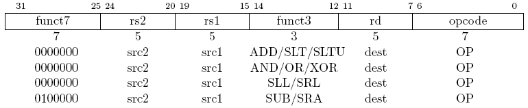 \
**Figure 1.** OP instruction encoding

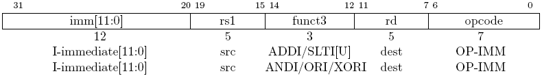 \
**Figure 2.** OP-IMM instruction encoding

The immediate variant shift instructions use `imm[4:0]` to encode the unsigned shift amount as shown in Figure 3.

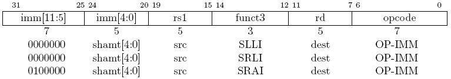 \
**Figure 3.** OP-IMM shift encoding

*Note: bit 30 is used to denote subtraction and arithmetic shifts (sign extension shift).*

**Table 1.** OP and OP-IMM minor op codes

| `instr[30]` | funct3 `instr[14:12]` | Instruction | Description |
| --- | --- | --- | --- |
| 0 | 000 | `ADD[I]`  | Addition |
| 1 | 000 | `SUB`     | Subtraction |
| 0 | 001 | `SLL[I]`  | Shift Left Logical |
| 0 | 010 | `SLT[I]`  | Set Less Than |
| 0 | 011 | `SLT[I]U` | Set Less Than Unsigned |
| 0 | 100 | `XOR[I]`  | Bitwise XOR |
| 0 | 101 | `SRL[I]`  | Shift Right Logical |
| 1 | 101 | `SRA[I]`  | Shift Right Arithmetic |
| 0 | 110 | `OR[I]`   | Bitwise OR |
| 0 | 111 | `AND[I]`  | Bitwise AND |

 

#### Upper Immediate Instructions

**Major Op Codes**

| LUI | AUIPC |
| --- | --- |
| 0b011_0111 | 0b001_0111 |

The load upper-immediate (`LUI`) instruction stores the 20-bit immediate value in the upper bits of the destination register `dest`.
The lower 12-bits are zeroed.

The add upper-immediate to PC (`AUIPC`) instruction builds PC-relative addresses.
It adds the 20-bit upper-immediate value to the current PC then stores it in the destination register `dest`.

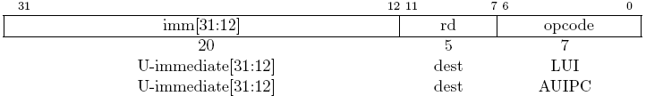 \
**Figure 4.** Upper immediate encoding

 

#### Unconditional Jump Instructions

**Major Op Codes**

| JAL | JALR|
| --- | --- |
| 0b110_1111 | 0b110_0111 |

Jump instructions are used to set the program counter (PC).
A primary use of the jump instruction is to perform a function call.
The destination register `dest` stores the address of the instruction following the jump (i.e. PC+4).

The jump and link (`JAL`) instructions uses indirect jumps, meaning it depends on the current PC.
Using indirect jumps helps in writing position-independent code.
The PC is set to the address obtained by adding the sign-extended immediate offset `imm[20:1]` with the current PC.
The encoded bit positions of the immediate value are out of order to increase overlap with other instructions.
The least-significant bit of the immediate is always zero, forcing two-byte alignment.
This allows the targeting of addresses $\plusmn$1 MiB.

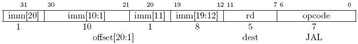 \
**Figure 4.** JAL instruction encoding

The jump and link register (`JALR`) instruction uses indirect jumps, meaning it does not depend on the current PC.
The PC is set to the address obtained by adding the sign-extended immediate offset `imm[11:0]` with the base register `rs1`.
The least-significant bit of the result is always set to zero, forcing two-byte alignment.

 \
**Figure 5.** JALR instruction encoding

These instructions will generate a misaligned instruction exception of the target address is not 4-byte aligned.

 

#### Conditional Branch Instructions

**Major Op Code**

| BRANCH |
| --- |
| 0b110_0011 |

Branch instructions are used to conditionally set the PC.
These are indirect jump instruction, meaning they depend on the current PC.
Using indirect jumps helps in writing position-independent code.
A primary use of indirect jumps is evaluating if statements.

The potential jump address is calculated by adding the **sign-extended** immediate offset `imm[12:1]` with the current PC.
This allows the targeting of addresses $\plusmn$4 KiB.

The branch instructions compare two register (`rs1` and `rs2`).
If the condition of the specific instruction is met, then the PC is set to the calculated address, otherwise the PC is incremented by 4 as usual.

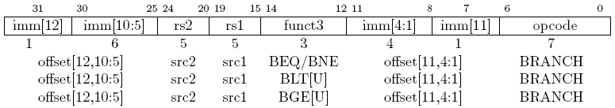 \
**Figure 6.** Branch instruction encoding

**Table 2.** Branch minor op codes

| funct3 `instr[14:12]` | Instruction | Description |
| --- | --- | --- |
| 000 | `BEQ`  | Branch If Equal |
| 001 | `BNE`  | Branch If Not Equal |
| 100 | `BLT`  | Branch If Less Than |
| 101 | `BGE`  | Branch If Greater Than or Equal |
| 110 | `BLTU` | Branch If Less Than Unsigned |
| 111 | `BGEU` | Branch If Greater Than or Equal Unsigned |

 

#### Load/Store Instructions

**Major Op Code**

| LOAD | STORE |
| --- | --- |
| 0b000_0011 | 0b010_0011 |

The load and store instructions read from and write to memory respectively.
A key feature of a RISC instruction set architecture (ISA) it that only these instructions access memory.
All other instructions operate on registers.
Memory addresses are calculated using the ALU by adding the base value register `base` with the sign-extended immediate offset.
The data width is encoded in the funct3 `width` field as shown in Table 3.

The address space is byte-addressed and little-endian (can be changed to big-endian using the [`mstatus` CSR](./CSR.md#machine-status-register-mstatus-and-mstatush)).
See the [memory map](./Lexington.md#memory-map) for address space mapping and access permissions.

There are five load instructions that read data from the calculated memory address to the destination register `dest`.
There is the 32-bit word (`LW`), 16-bit half-word (`LH`), and 8-bit byte (`LB`) load instructions.
The half-word load and byte load are sign-extended into the 32-bit register.
These two also have an unsigned variant, `LHU` and `LBU`, that zero fills the upper bits.

*Note: loads with `dest`=x0 must still raise exceptions*

 \
**Figure 7.** Load instruction encoding

There are three store instructions that write data to the calculated memory address from the source register `src`.
There is the 32-bit word (`SW`), 16-bit half-word (`SH`), and 8-bit byte (`SB`) store instructions.
No sign-extension or zero padding is performed and only the associated number of bits are written to memory.

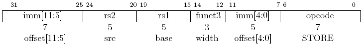 \
**Figure 8.** Store instruction encoding

**Table 3.** Load/Store Instructions

| funct3 `instr[14:12]` | Instruction | Description |
| --- | --- | ---
| 000 | `LB`  | Load Byte (8-bits) |
| 001 | `LH`  | Load Half-Word (16-bits) |
| 010 | `LW`  | Load Word (32-bits) |
| 100 | `LBU` | Load Byte Unsigned (8-bits) |
| 101 | `LHU` | Load Half-Word Unsigned (16-bits) |
| 000 | `SB`  | Store Byte (8-bits) |
| 001 | `SH`  | Store Half-Word (16-bits) |
| 010 | `SW`  | Store Word (32-bits) |

 

#### Memory Ordering Instructions

**Major Op Code**

| MISC-MEM |
| --- |
| 0b000_1111 |

The implementation has only a single hardware thread (hart), thus the memory ordering instructions are treated as `NOP`.

The `FENCE` instruction guarantees ordering between memory operations from different harts.
The predecessor and successor fields are ignored.

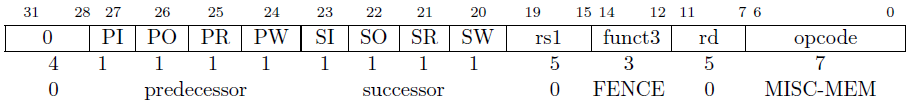 \
**Figure 9.** Fence instruction encoding

The `FENCE.I` instructions synchronizes the instruction and data streams.
This is typically used in self-modifying code to flush the instruction cache.

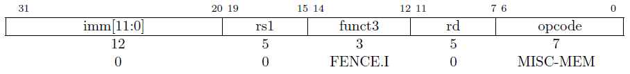

**Table 4.** Fence Instructions

| funct3 `inst[14:12]` | Instruction | Description |
| --- | --- | --- |
| 000 | `FENCE`   | Treat as `NOP` |
| 001 | `FENCE.I` | Treat as `NOP` |

 

#### CSR Instruction

**Major Op Code**

| SYSTEM |
| --- |
| 0b111_0011 |

The control and status register (CSR) instructions provide read and write access to registers that control and report the status the RISC-V core.
For detailed register information, see the [CSR documentation](./CSR.md)

Each instruction reads and writes a CSR in a single instruction.
The `csr` field indicates the address of the CSR to be accessed.
The `dest` field indicates the destination register for the read value.
The `source` or `uimm[4:0]` field is used when writing to the CSR.
Each CSR instruction has unique write behavior.

The CSR read/write (`CSRRW`) instruction write the source register `source` to the CSR.

The CSR read and set bits (`CSRRS`) instruction uses the source register `source` as a bit mask to set bits in the CSR.
Thus, the CSR is OR'd with `source`.

The CSR read and clear bits (`CSRRC`) instruction uses the source register `source` as a bit mask to clear bits in the CSR.
Thus, the CSR is AND'd with NOT `source`.

The immediate variants (`CSRRWI`, `CSRRSI`, and `CSRRCI`) use the zero-extended, 5-bit unsigned immediate value rather than the source register `source`.

Attempts to access a non-existent CSR raise an illegal instruction exception.
Attempts to access a CSR without appropriate privilege level (or write to a read-only) also raise an illegal instruction exception.
For a read/write register with some read-only bits, write to the read-only bits are ignored.
If `dest`=x0, then CSR read side-effects shall not occur (not used in this implementation).
For `CSRRS` and `CSRRC`, if `source`=x0, then CSR write side-effects shall not occur, such as raising exceptions on access to read-only CSRs.
Likewise, for `CSRRSI` and `CSRRCI`, if the immediate value is zero, then CSR write side-effects shall not occur, such as raising exceptions on access to read-only CSRs.

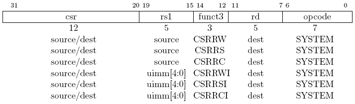 \
**Figure 10.** CSR instruction encoding

**Table 4.** CSR Instructions

| `inst[31:20]` | funct3 `instr[14:12]` | Instruction | Description |
| --- | --- | --- | --- |
| `csr` | 001 | `CSRRW`  | CSR read & write |
| `csr` | 010 | `CSRRS`  | CSR read & set |
| `csr` | 011 | `CSRRC`  | CSR read & clear |
| `csr` | 101 | `CSRRWI` | CSR read & write immediate |
| `csr` | 110 | `CSRRSI` | CSR read & set immediate |
| `csr` | 111 | `CSRRCI` | CSR read & clear immediate |

 

#### System Instructions

**Major Op Code**

| SYSTEM |
| --- |
| 0b111_0011 |

*Note: CSR instructions are in the [CSR Instruction](#csr-instruction) section*

This implementation implements three system instructions.
Their details are shown in Table 5.

The environment call `ECALL` instruction generates an environment-call-from-M-mode exception.

The environment break `EBREAK` instruction generates a breakpoint exception.
This implementation does not feature a hardware debug module.

*Note: the `ECALL` and `EBREAK` instructions are unique in that they set the `mepc` CSR to the address of **this** instruction.
Additionally, these instructions do not increment the `minstret` CSR.*

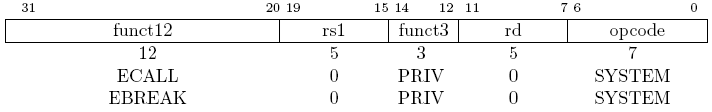 \
**Figure 11.** Environment instruction encoding

The machine-mode trap return `MRET` instructions sets the `pc` the value stored in `mepc`.
This is handled by the [Trap Unit](./Trap.md).
The decoder is responsible for raising the `mret` flag when this instruction is executed.

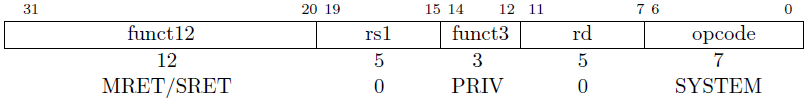 \
**Figure 12.** Trap-return instruction encoding

The wait for interrupt (`WFI`) instruction is a microarchitecture hint instruction.
This implementation treats `WFI` as a `NOP`.

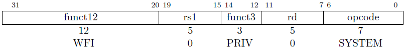 \
**Figure 13.** Wait for interrupt instruction encoding

**Table 5.** System Instructions

| `inst[31:20]` | funct3 `instr[14:12]` | Instruction | Description |
| --- | --- | --- | --- |
| 0000_0000_0000 | 000 | `ECALL`  | Environment call |
| 0000_0000_0001 | 000 | `EBREAK` | Environment break |
| 0011_0000_0010 | 000 | `MRET`   | Machine-mode return |
| 0001_0000_0101 | 000 | `WFI`    | Wait for interrupt |

 
 

## Decoder Logic

**Table 6.** Decoder output sources

| Port | Output Logic |
| --- | --- |
| `rs1_en`          | High if `rs1` appears in Table 7, else low
| `rs2_en`          | High if `rs1` appears in Table 7, else low
| `rs1_addr`        | `inst[19:15]`
| `rs2_addr`        | `inst[24:20]`
| `csr_rd_en`       | High if for CSR instructions, else low
| `csr_addr`        | `inst[31:20]`
| `csr_explicit_rd` | High if CSR instruction and `dest`!=x0, else low
| `alu_op`          | See Table 7
| `src1`            | See Table 7
| `src2`            | See Table 7
| `alt_data`        | See Table 7
| `lsu_op`          | See Table 7
| `dest_addr`       | See Table 7
| `next_pc`         | See Table 7
| `illegal_inst`    | Low unless asserted in Table 7
| `inst_misaligned` | Set to `next_pc[1]`
| `ecall`           | Low unless asserted in Table 7
| `ebreak`          | Low unless asserted in Table 7
| `mret`            | Low unless asserted in Table 7

**Table 7.** Decoder truth table

| Instruction| ISA opcode          | | `next_pc`         | `alu_op`  | `src1`   | `src2`       |`alt_data`|`dest_addr`| `lsu_op`  | exception? | notes |
| ---------- | ------------------- |-| ----------------- | --------  | ------   | ------------ | -------- | --------- | --------  | ---------- | ----- |
| `NOP`      | 001_0011 (OP-IMM)   | | `pc`+4            | ALU_NOP   | 0        | 0            | 0        | 0         | LSU_NOP   | no | this is a pseudo instruction for `ADDI x0, x0, 0`
| `ADD`      | 011_0011 (OP)       | | `pc`+4            | ALU_ADD   | `rs1`    | `rs2`        | 0        | `rd`      | LSU_REG   | no
| `SUB`      | 011_0011 (OP)       | | `pc`+4            | ALU_SUB   | `rs1`    | `rs2`        | 0        | `rd`      | LSU_REG   | no
| `SLL`      | 011_0011 (OP)       | | `pc`+4            | ALU_SLL   | `rs1`    | `rs2`        | 0        | `rd`      | LSU_REG   | no
| `SLT`      | 011_0011 (OP)       | | `pc`+4            | ALU_SLT   | `rs1`    | `rs2`        | 0        | `rd`      | LSU_REG   | no
| `SLTU`     | 011_0011 (OP)       | | `pc`+4            | ALU_SLTU  | `rs1`    | `rs2`        | 0        | `rd`      | LSU_REG   | no
| `XOR`      | 011_0011 (OP)       | | `pc`+4            | ALU_XOR   | `rs1`    | `rs2`        | 0        | `rd`      | LSU_REG   | no
| `SRL`      | 011_0011 (OP)       | | `pc`+4            | ALU_SRL   | `rs1`    | `rs2`        | 0        | `rd`      | LSU_REG   | no
| `SRA`      | 011_0011 (OP)       | | `pc`+4            | ALU_SRA   | `rs1`    | `rs2`        | 0        | `rd`      | LSU_REG   | no
| `OR`       | 011_0011 (OP)       | | `pc`+4            | ALU_OR    | `rs1`    | `rs2`        | 0        | `rd`      | LSU_REG   | no
| `AND`      | 011_0011 (OP)       | | `pc`+4            | ALU_AND   | `rs1`    | `rs2`        | 0        | `rd`      | LSU_REG   | no
| `ADDI`     | 001_0011 (OP-IMM)   | | `pc`+4            | ALU_ADD   | `rs1`    | `imm[11:0]`  | 0        | `rd`      | LSU_REG   | no | immediate is sign-extended
| `SLLI`     | 001_0011 (OP-IMM)   | | `pc`+4            | ALU_SLL   | `rs1`    | `imm[4:0]`   | 0        | `rd`      | LSU_REG   | no | immediate is sign-extended
| `SLTI`     | 001_0011 (OP-IMM)   | | `pc`+4            | ALU_SLT   | `rs1`    | `imm[11:0]`  | 0        | `rd`      | LSU_REG   | no | immediate is sign-extended
| `SLTUI`    | 001_0011 (OP-IMM)   | | `pc`+4            | ALU_SLTU  | `rs1`    | `imm[11:0]`  | 0        | `rd`      | LSU_REG   | no | immediate is sign-extended, then compared as unsigned
| `XORI`     | 001_0011 (OP-IMM)   | | `pc`+4            | ALU_XOR   | `rs1`    | `imm[11:0]`  | 0        | `rd`      | LSU_REG   | no | immediate is sign-extended
| `SRLI`     | 001_0011 (OP-IMM)   | | `pc`+4            | ALU_SRL   | `rs1`    | `imm[4:0]`   | 0        | `rd`      | LSU_REG   | no | immediate is sign-extended
| `SRAI`     | 001_0011 (OP-IMM)   | | `pc`+4            | ALU_SRA   | `rs1`    | `imm[4:0]`   | 0        | `rd`      | LSU_REG   | no | immediate is sign-extended
| `ORI`      | 001_0011 (OP-IMM)   | | `pc`+4            | ALU_OR    | `rs1`    | `imm[11:0]`  | 0        | `rd`      | LSU_REG   | no | immediate is sign-extended
| `ANDI`     | 001_0011 (OP-IMM)   | | `pc`+4            | ALU_AND   | `rs1`    | `imm[11:0]`  | 0        | `rd`      | LSU_REG   | no | immediate is sign-extended
| `LUI`      | 011_0111 (LUI)      | | `pc`+4            | ALU_ADD   | 0        | `imm[31:12]` | 0        | `rd`      | LSU_REG   | no | upper immediate with lower bits zeroed
| `AUIPC`    | 001_0111 (AUIPC)    | | `pc`+4            | ALU_ADD   | `pc`     | `imm[31:12]` | 0        | `rd`      | LSU_REG   | no | upper immediate with lower bits zeroed
| `JAL`      | 110_1111 (JAL)      | | `pc`+`imm[20:1]`  | ALU_ADD   | `pc`     | 4            | 0        | `rd`      | LSU_REG   | *caught by fetch* | immediate is sign-extended, lowest bit is zeroed
| `JALR`     | 110_0111 (JALR)     | | `rs1`+`imm[11:0]` | ALU_ADD   | `pc`     | 4            | 0        | `rd`      | LSU_REG   | *caught by fetch* | immediate is sign-extended, lowest bit of calculated value is ignored/zeroed
| `BEQ`      | 110_0011 (BRANCH)   | | *see note* ->     | ALU_XOR   | `rs1`    | `rs2`        | 0        | ?         | LSU_NOP   | no | `next_pc` <= (`alu_zero`)  ? (`pc`+`imm[12:1]`) : (`pc`+4); immediate is sign-extended, lowest bit is zeroed
| `BNE`      | 110_0011 (BRANCH)   | | *see note* ->     | ALU_XOR   | `rs1`    | `rs2`        | 0        | ?         | LSU_NOP   | no | `next_pc` <= (`!alu_zero`) ? (`pc`+`imm[12:1]`) : (`pc`+4); immediate is sign-extended, lowest bit is zeroed
| `BLT`      | 110_0011 (BRANCH)   | | *see note* ->     | ALU_SLT   | `rs1`    | `rs2`        | 0        | ?         | LSU_NOP   | no | `next_pc` <= (`!alu_zero`) ? (`pc`+`imm[12:1]`) : (`pc`+4); immediate is sign-extended, lowest bit is zeroed
| `BGE`      | 110_0011 (BRANCH)   | | *see note* ->     | ALU_SGE   | `rs1`    | `rs2`        | 0        | ?         | LSU_NOP   | no | `next_pc` <= (`!alu_zero`) ? (`pc`+`imm[12:1]`) : (`pc`+4); immediate is sign-extended, lowest bit is zeroed
| `BLTU`     | 110_0011 (BRANCH)   | | *see note* ->     | ALU_SLTU  | `rs1`    | `rs2`        | 0        | ?         | LSU_NOP   | no | `next_pc` <= (`!alu_zero`) ? (`pc`+`imm[12:1]`) : (`pc`+4); immediate is sign-extended, lowest bit is zeroed
| `BGEU`     | 110_0011 (BRANCH)   | | *see note* ->     | ALU_SGEU  | `rs1`    | `rs2`        | 0        | ?         | LSU_NOP   | no | `next_pc` <= (`!alu_zero`) ? (`pc`+`imm[12:1]`) : (`pc`+4); immediate is sign-extended, lowest bit is zeroed
| `LB`       | 000_0011 (LOAD)     | | `pc`+4            | ALU_ADD   | `rs1`    | `imm[11:0]`  | 0        | ?         | LSU_LOAD  | *caught by LSU* | immediate is sign-extended
| `LH`       | 000_0011 (LOAD)     | | `pc`+4            | ALU_ADD   | `rs1`    | `imm[11:0]`  | 0        | ?         | LSU_LOAD  | *caught by LSU* | immediate is sign-extended
| `LBU`      | 000_0011 (LOAD)     | | `pc`+4            | ALU_ADD   | `rs1`    | `imm[11:0]`  | 0        | ?         | LSU_LOAD  | *caught by LSU* | immediate is sign-extended
| `LW`       | 000_0011 (LOAD)     | | `pc`+4            | ALU_ADD   | `rs1`    | `imm[11:0]`  | 0        | ?         | LSU_LOAD  | *caught by LSU* | immediate is sign-extended
| `LHU`      | 000_0011 (LOAD)     | | `pc`+4            | ALU_ADD   | `rs1`    | `imm[11:0]`  | 0        | ?         | LSU_LOAD  | *caught by LSU* | immediate is sign-extended
| `SB`       | 010_0011 (STORE)    | | `pc`+4            | ALU_ADD   | `rs1`    | `imm[11:0]`  | `rs2`    | ?         | LSU_STORE | *caught by LSU* | immediate is sign-extended
| `SH`       | 010_0011 (STORE)    | | `pc`+4            | ALU_ADD   | `rs1`    | `imm[11:0]`  | `rs2`    | ?         | LSU_STORE | *caught by LSU* | immediate is sign-extended
| `SW`       | 010_0011 (STORE)    | | `pc`+4            | ALU_ADD   | `rs1`    | `imm[11:0]`  | `rs2`    | ?         | LSU_STORE | *caught by LSU* | immediate is sign-extended
| `FENCE`    | 000_1111 (MISC-MEM) | | `pc`+4            | ALU_NOP   | 0        | 0            | 0        | 0         | LSU_NOP   | no | treated as `NOP`
| `FENCE.I`  | 000_1111 (MISC-MEM) | | `pc`+4            | ALU_NOP   | 0        | 0            | 0        | 0         | LSU_NOP   | no | treated as `NOP`
| `CSRRW`    | 111_0011 (SYSTEM)   | | `pc`+4            | ALU_NOP   | `rs1`    | `csr`        | `csr`    | `rd`      | LSU_CSRRW | *caught by CSR*
| `CSRRS`    | 111_0011 (SYSTEM)   | | `pc`+4            | ALU_OR    | `rs1`    | `csr`        | `csr`    | `rd`      | *see note*| *caught by CSR* | `lsu_op` <= (`source`==x0) ? LSU_CSRR : LSU_CSRRW
| `CSRRC`    | 111_0011 (SYSTEM)   | | `pc`+4            | ALU_AND   | ~`rs1`   | `csr`        | `csr`    | `rd`      | *see note*| *caught by CSR* | `lsu_op` <= (`source`==x0) ? LSU_CSRR : LSU_CSRRW
| `CSRRWI`   | 111_0011 (SYSTEM)   | | `pc`+4            | ALU_NOP   |`imm[4:0]`| `csr`        | `csr`    | `rd`      | LSU_CSRRW | *caught by CSR* | immediate is unsigned, zero-extended
| `CSRRSI`   | 111_0011 (SYSTEM)   | | `pc`+4            | ALU_OR    |`imm[4:0]`| `csr`        | `csr`    | `rd`      | *see note*| *caught by CSR* | `lsu_op` <= (`imm[4:0]`==0) ? LSU_CSRR : LSU_CSRRW; immediate is unsigned, zero-extended
| `CSRRCI`   | 111_0011 (SYSTEM)   | | `pc`+4            | ALU_AND   |~`imm[4:0]`|`csr`        | `csr`    | `rd`      | *see note*| *caught by CSR* | `lsu_op` <= (`imm[4:0]`==0) ? LSU_CSRR : LSU_CSRRW; immediate is unsigned, zero-extended
| `ECALL`    | 111_0011 (SYSTEM)   | | `pc`+4            | ALU_NOP   | 0        | 0            | 0        | 0         | LSU_NOP   | **`ecall`** asserted
| `EBREAK`   | 111_0011 (SYSTEM)   | | `pc`+4            | ALU_NOP   | 0        | 0            | 0        | 0         | LSU_NOP   | **`ebreak`** asserted
| `MRET`     | 111_0011 (SYSTEM)   | | `pc`+4            | ALU_NOP   | 0        | 0            | 0        | 0         | LSU_NOP   | **`mret`** asserted
| `WFI`      | 111_0011 (SYSTEM)   | | `pc`+4            | ALU_NOP   | 0        | 0            | 0        | 0         | LSU_NOP   | no | treated as `NOP`
| *other*    |                     | | `pc`+4            | ALU_NOP   | 0        | 0            | 0        | 0         | LSU_NOP   | **`illegal_inst`** asserted
