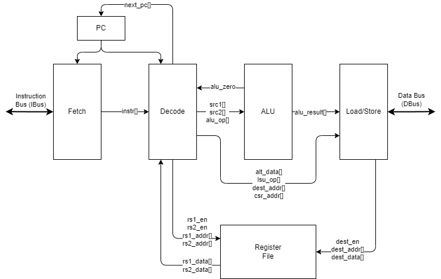
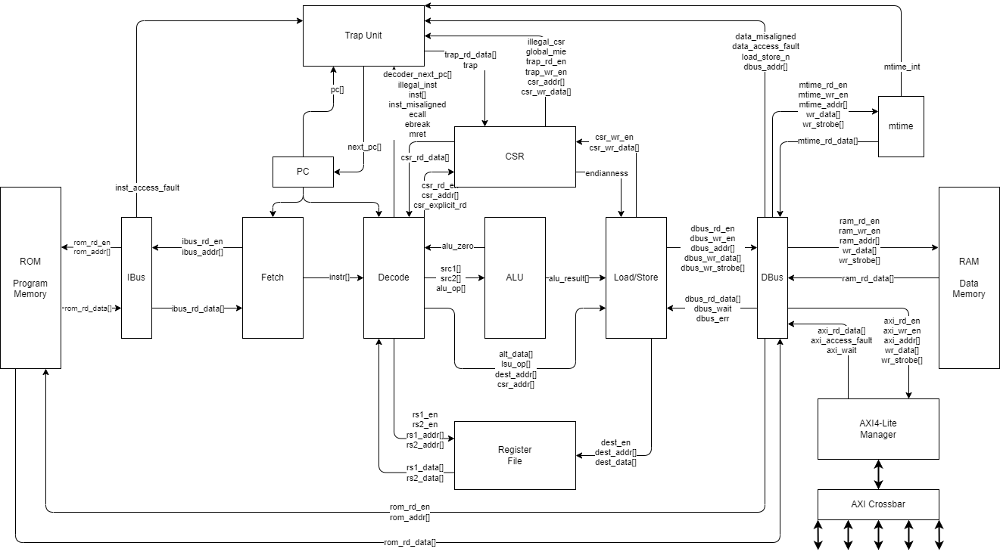

# Lexington Microarchitecture

## Design

The GPro Lexington CPU is a single-cycle RISC-V RV32I implementation.
It features a read-only program memory and separate read/write data memory.
Figure 1 shows a simplified diagram of the CPU core

 \
**Figure 1.** GPro Lexington minimal core implementation

## Behavior

Detailed behavior of each submodule is contained in these documents:

- [ROM](./ROM.md)
- [RAM](./RAM.md)
- [Register File](./RegisterFile.md)
- [PC](./PC.md)
- [Fetch Unit](./Fetch.md)
- [Decode Unit](./Decode.md)
- [Arithmetic Logic Unit (ALU)](./ALU.md)
- [Load/Store Unit (LSU)](./Load_Store.md)
- [Data Bus (DBus)](./DBus.md)
- [Control and Status Registers (CSR)](./CSR.md)
- [Trap Unit](./Trap.md)

The list of supported instructions can be found in the [Decoder](./Decoder.md) section.

Information about programming the device is found in the [Toolchain](./Toolchain.md) section.

A full diagram of the SoC (minus peripherals) is shown in Figure 2.

 \
**Figure 2.** GPro Lexington SoC

### Memory Map

Memory is divided into four major regions as shown in Figure 3:

- **ROM**: This read-only executable memory region contains the reset instruction location (0x0000_0000).
Memory must begin at address 0x0000_0000 and may be up to 1 GB (default 4 KB).
This is where the instruction memory is located.
- **RAM**: This secondary memory region and is where the data memory is located.
Memory must begin at address 0x8000_000 and may be up to 1 GB (default 4 KB).
- ***Reserved***: This region is reserved for future use
- **SYSTEM**: This region is for memory mapped system devices such as the system timer `mtime`.
See [Load/Store specification](./Load_Store.md#memory-mapped-devices) for device addresses.
- **AXI I/O**: This region is for memory mapped I/O peripherals such as UART.
See [Load/Store specification](./Load_Store.md#memory-mapped-devices) for device addresses.

{height=300px} \
**Figure 3.** Memory Map

Addresses for system devices, such as the machine-mode timer (mtime), can be found in the [DBus](./DBus.md) section.
Addresses for peripheral devices can be found in the [AXI4-Lite Crossbar](./AXI4-Lite_Crossbar.md) section.

### Reset

Upon reset, the `pc` is set to 0x0000_0000.

### Non-Maskable Interrupts (NMI)

NMIs are triggered by hardware error conditions.
They case an immediate jump to 0x0000_0000 and set the `mepc` CSR to the address of the instruction that was interrupted.
Additionally, the MSB of `mcause` is set to one, indicating an interrupt, and all other bits are set to zero.
This implementation has no NMI sources.
