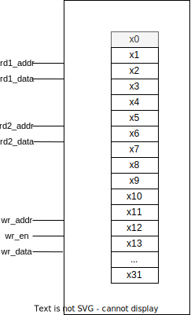

# Register File

This is the main integer register file for the CPU core.
It features asynchronous reads and synchronous writes.

## Ports

#### Parameters

- **`WIDTH = 32`** data width
- **`REG_COUNT = 32`** number of registers
- **`ADDR_WIDTH = 6`** = ceil(log2(`WIDTH`))

#### Inputs

- **`clk`** write port clock
- **`rd1_addr[ADDR_WIDTH-1:0]`** address for read port 1
- **`rd2_addr[ADDR_WIDTH-1:0]`** address for read port 2
- **`wr_addr[ADDR_WIDTH-1:0]`** address for write port
- **`wr_en`** enable for write port *(active high)*
- **`wr_data[WIDTH-1:0]`** data in for write port

#### Outputs

- **`rd1_data[WIDTH-1:0]`** data out for read port 1
- **`rd2_data[WIDTH-1:0]`** data out for read port 2

## Behavior

This module behaves as a register file with two read ports and one write port.
Reads are performed asynchronously.
Writes are performed synchronously.
Additionally, reading from address zero always returns zeros.
Writing to address zero has no effect.

 \
**Figure 1.** Register File block diagram
