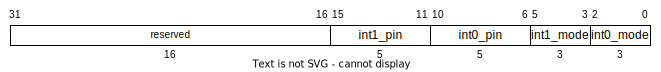

# General Purpose Input/Output (GPIO*x*)

Each GPIO bank has 16 memory mapped I/O ports.
All ports support both input and output.
There are two fully configurable interrupts that can be sourced from any of the 16 ports.
Interrupts support both edge and level triggers.

## Ports

### Parameters

- **`WIDTH=32`** bus width
- **`PIN_COUNT=16`** I/O pin count

### In/Out

- **`io_pins[COUNT-1:0]`** I/O pins

### Inputs

- **`axi_s`** AXI subordinate interface

### Outputs

- **`int0`** interrupt 0
- **`int1`** interrupt 1

## Behavior

The behavior of the GPIO pins is determined by the memory mapped registers described in Table 1.
Read and write access to these registers occurs synchronous to the AXI clock.

**Table 1.** GPIO Memory Mapped Registers
| Address Offset | Default Value | R/W | Name | Description |
| --- | --- | --- | --- | --- |
| 0x0 | 0 | r/w | `gpiox_mode`      | sets each pin as input or output (0=input,1=output)
| 0x4 | - | r/- | `gpiox_idata`     | input value for each pin (0=low,1=high)
| 0x8 | 0 | r/w | `gpiox_odata`     | output value for each pin (0=low,1=high)
| 0xC | 0 | r/w | `gpiox_int_conf`  | interrupt configuration register

Bit *i* of the `mode`, `idata`, and `odata` registers corresponds to pin *i*.
Data in the `idata` register is read asynchronously from the I/O pins.
If a pin does not exist, the corresponding bit is read-only zero.
The *int_conf* register encoding is shown in Figure 1.

**Figure 1.** `gpiox_int_conf` register encoding

The int*x*_mode fields set the mode of interrupt *x*.

**Table 2.** GPIO Interrupt Modes
| Value | Mode | Description |
| --- | --- | --- |
| 0b000 | DISABLE | Disables the interrupt source |
| 0b100 | RISING  | Interrupt triggers on rising-edge |
| 0b101 | FALLING | Interrupt triggers on falling-edge |
| 0b110 | HIGH    | Interrupt triggers when high |
| 0b111 | LOW     | Interrupt triggers when low |
| *other* | *reserved* | 

The int*x*_pin fields select the source pin for interrupt *x*.
