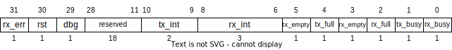

# UART Transceiver

This is a memory-mapped, full-duplex UART transceiver with FIFOs and interrupt support for both transmit and receive.
The BAUD rate is static at runtime, but can be configured at compile time with a default of 9600.
This implementation uses the following parameters:
- BAUD: 9600
- Data bits: 8
- Stop bits: 1
- Parity: none
- Flow control: none

## Ports

### Parameters

- **`WIDTH = 32`** bus width
- **`BUS_CLK = 40_000_000`** bus clock frequency in Hz
- **`BAUD = 9600`** baud rate
- **`FIFO_DEPTH = 8`** FIFO depth for both TX and RX (depth 0 is invalid)

### Inputs

- **`rx`** UART RX signal
- **`dbg_en`** Enable override access by debugger
- **`dbg_send`** Debugger send flag
- **`dbg_dout [7:0]`** Debugger TX data (bypasses FIFO)
- **`axi_s`** AXI subordinate interface

### Outputs

- **`tx`** UART TX signal
- **`dbg_recv`** Debugger receive flag
- **`dbg_din [7:0]`** Debugger RX data (bypasses FIFO)
- **`dbg_rx_busy`** RX busy flag for debugger
- **`dbg_tx_busy`** TX busy flag for debugger
- **`rx_int`** receive interrupt
- **`tx_int`** transmit interrupt

## Behavior

The module includes a dedicated interface for a hardware debugger.
When `dbg_en` is asserted, the debugger is directly connected to the RX and TX submodules bypassing the FIFOs.
When not asserted, transmit data is read from the TX FIFO and received data is written to the RX FIFO.
The interrupts `rx_int` and `tx_int` are disabled when `dbg_en` is asserted.

The submodules retain their current state when `dbg_en` is asserted.
If debug is asserted while the RX submodule is busy receiving, then the received data will be intercepted by the debugger.
If debug is asserted while the TX submodule is busy transmitting, then the transmission of the data byte from the FIFO continues as normal.
The transceiver submodules are unaware of the debugger override behavior.
All data and control signal multiplexing occurs at the top level UART module.

Note that all `dbg_` output signals are always connected to the submodules.
The hardware debugger can use this to *spy* on incoming data for example.

The memory-mapped registers shown in Table 1 control the behavior of the UART transceiver and interrupt signals.

**Table 1.** Memory-Mapped Registers

| Address Offset | Default | R/W | Name | Description |
| --- | --- | --- | --- | --- |
| 0x0 | 0 | r/w | `uartx_data`    | Passes send or receive 8 bits of data when written or read from respectively
| 0x4 | - | r/w | `uartx_conf`  | Config and status register

 

The `uartx_data` register is shown in Figure 1.
The lowest 8 bits are read/write and are used for data transmission.
The upper bits [31:9] are read-only zero.
A write to this register inserts data into the TX FIFO.
If the TX FIFO is full, the new write data is discarded.
A read from this register removes data from the RX FIFO.
If the RX FIFO is empty, `0x00` is read.
Additionally, if new RX data is received and the RX FIFO is full, the new data will be discarded.

 \
**Figure 1.** Data register

 

The `uartx_conf` register is shown in Figure 2.
This register is used to configure the UART transceiver as well as read it's status.
Table 2 contains detailed information about each field.

 \
**Figure 2.** Config register

 

**Table 2.** Config Register Fields `uartx_conf`
| Index | Size | Default | R/W | Name | Description |
| --- | --- | --- | --- | --- | --- |
| 0 | 1 | 0 | ro | `rx_busy`    | Asserted when the data is currently being received
| 1 | 1 | 0 | ro | `tx_busy`    | Asserted the data is currently being transmitted
| 2 | 1 | 0 | ro | `rx_full`    | Asserted when the RX FIFO is full
| 3 | 1 | 1 | ro | `rx_empty`   | Asserted when the RX FIFO is empty
| 4 | 1 | 0 | ro | `tx_full`    | Asserted when the TX FIFO is full
| 5 | 1 | 1 | ro | `tx_empty`   | Asserted when the RX FIFO is empty
| 8:6 | 3 | 0 | r/w | `rx_int`  | RX interrupt configuration (*see Table 3*)
| 10:9 | 2 | 0 | r/w | `tx_int`  | TX interrupt configuration (*see Table 3*)
| 28:11 | 20 | 0 | ro | *reserved* | read-only zero
| 29 | 1 | 0 | ro | `dbg`       | Asserted when hardware debugger has override control
| 30 | 1 | 0 | ~~wo~~ ro | ~~`rst`~~       | ~~Writing a 1 to this bit resets the UART module. Reads always return zero.~~
| 31 | 1 | 0 | ro | `rx_err`    | Sticky bit indicating an RX error. A read clears the bit

 

Interrupt behavior is configured using the `rx_int` and `tx_int` field of the `uartx_conf` register.
Interrupt source enable bits are shown in Table 3.
The RX/TX done interrupt source is triggered when an data is sent or received respectively.
This interrupt triggers regardless of the content of the FIFOs.
The FIFO interrupt is connected to the RX FIFO full and TX FIFO empty for the RX and TX interrupts respectively.
The `rx_int` field has a third bit that enables the RX error interrupt.

The FIFO full/empty interrupts as well as RX error interrupt sources must be resolved to clear the interrupt.
For the FIFOs, this means reading data for RX full or writing data for TX empty.
For RX error, this means reading the `uartx_conf` register to clean the `rx_err` sticky bit.
Alternately, the interrupt source can be disabled.

**Table 3.** Interrupt Configuration
| Index | Interrupt Mode |
| --- | --- |
| 0 | RX/TX done interrupt
| 1 | FIFO interrupt (RX full/TX empty)
| 3 | RX error interrupt (`rx_int` only)

## RX Submodule

The UART RX submodule is responsible for deserializing input data from the `rx` serial input.
All ports, except the `rx` input, are sensitized to the faster bus clock `clk`.
However, detection of start bits, except in the case of chained transmissions, is sensitized to the bus clock frequency, not the slower BAUD clock frequency.

### Ports

#### Parameters

- **`BUS_CLK = 40_000_000`** Bus clock frequency in Hz
- **`BAUD = 9600`** BAUD rate

#### Inputs

- **`clk`** Bus clock
- **`rst_n`** reset (active-low)
- **`rx`** RX serial input

#### Outputs

- **`din [7:0]`** Receive data
- **`busy`** Busy flag
- **`recv`** Data received flag
- **`err`** Error flag

### Behavior

The `busy` signal transitions from LOW to HIGH when `rx` is LOW.
This enables the clock divide counter which starts at 0 then increments until `BUS_CLK / BAUD` at which time the counter is again reset to 0.
Serial data is sampled midway through the clock divide counter cycle.

If the start bit sample is HIGH, then a false start is declared.
The `busy` signal is lowered, the clock divide counter stops, and the receive state machine is frozen.

The data bits are received LSB to MSB and stored in an internal buffer.
The stop bit is checked.
One divided clock cycle after the stop bit, the buffered data is sent to the `din` port.
If the stop bit was valid, the `recv` signal is asserted for one bus clock cycle.
If the stop bis was not valid, the `err` signal is asserted for one bus clock cycle.

The deserializer state machine is capable of detecting a start bit immediately following a stop bit.
In this case, the `busy` signal is never lowered.
If no chained transition is detected, the `busy` signal is lowered until a new start bit is detected.

## TX Submodule

The UART TX submodule is responsible for serializing output data to the `tx` serial output.
All ports, except the `tx` output, are sensitized to the faster bus clock `clk`.
However, the beginning of a new transmission is sensitized to the bus clock `clk`, not the slower BAUD clock frequency.
This means transmission begins immediately after the `send` signal is asserted.

### Ports

#### Parameters

- **`BUS_CLK = 40_000_000`** Bus clock frequency in Hz
- **`BAUD = 9600`** BAUD rate

#### Inputs

- **`clk`** Bus clock
- **`rst_n`** reset (active-low)
- **`send`** Send data flag
- **`din [7:0]`** Send data

#### Outputs

- **`tx`** TX serial output
- **`busy`** Busy flag
- **`done`** Done flag

### Behavior

If not `busy`, when the `send` signal is asserted for a single cycle (or more) the `busy` signal is asserted and the `din` data is buffered internally.
The internal `din` buffer allows the source data to change mid-transmission without affecting the transmitted data.
The `busy` signal enables the clock divide counter which starts at 0 then increments until `BUS_CLK / BAUD` at which time the counter is again reset to 0.
Serial data is transmitted when the counter equals 0.

Immediately after the `busy` signal is asserted, the `tx` is set LOW, sending the start bit.
The data is then serialized from LSB to MSB.
The `tx` signal is then set HIGH, sending the stop bit.
After the full stop bit has been sent, the `busy` signal is lowered, stopping the clock divide counter.
Additionally, the `done` signal is asserted for one bus clock cycle.

A transmission can be chained immediately after another by asserting the `send` signal the first cycle (or before) the `busy` signal is lowered.
Note that the `send` signal is ignored when `busy` is asserted.
